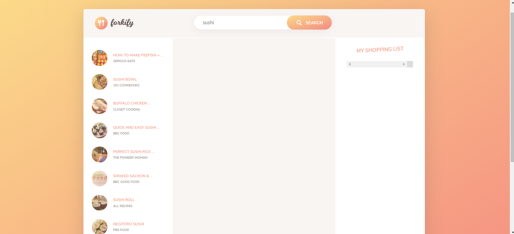
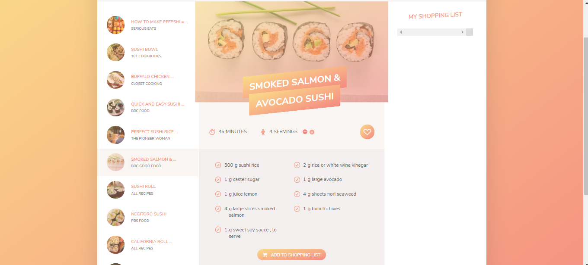
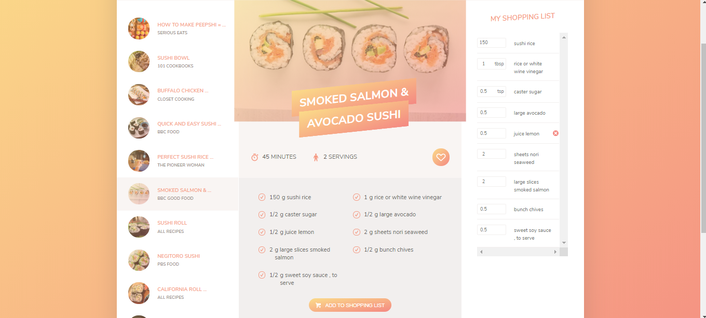

# Budget Controller App

This was the final project as part of a Udemy course - [The Complete JavaScript Course 2020](https://www.udemy.com/the-complete-javascript-course/). Forkify is a recipe finding web application which uses data from the [Forkify](http://forkify-api.herokuapp.com/) API. While it is a fairly basic web application, it can be used as a guide to cook one's favorite dish. Beyond accessing recipes from different sources online, it also provides information on the number and amount of ingredients needed to build a specific dish according to the number of people to serve.

This app uses modern JavaScript tools, such as Webpack to bundle the modules, and Babel to convert ES6, ES7 and ES8 back to ES5. The user can search for a specific recipe, and add ingredients to a shopping list or save to a favourites list via local storage.

You can click [HERE](/) to see a demo and search for your favourite recipe.

## Features

- User can search over 1,000,000 recipes.
- Powered by the Forkify API.
- Displays the ingredients required to prepare a dish.
- Allows user to choose serving size and accordingly adjusts ingredients.
- Displays recipe images.
- Directs user to source site for detailed recipe procedure.
- Ingredients can be added/removed to/from the shopping list.

## 📷 Screen Shots

### Enter your query in the Search Bar!

### Choose from a variety of recipes to get a brief overview of the recipe!

### Change serving size and Add the ingredients to your Shopping List!

